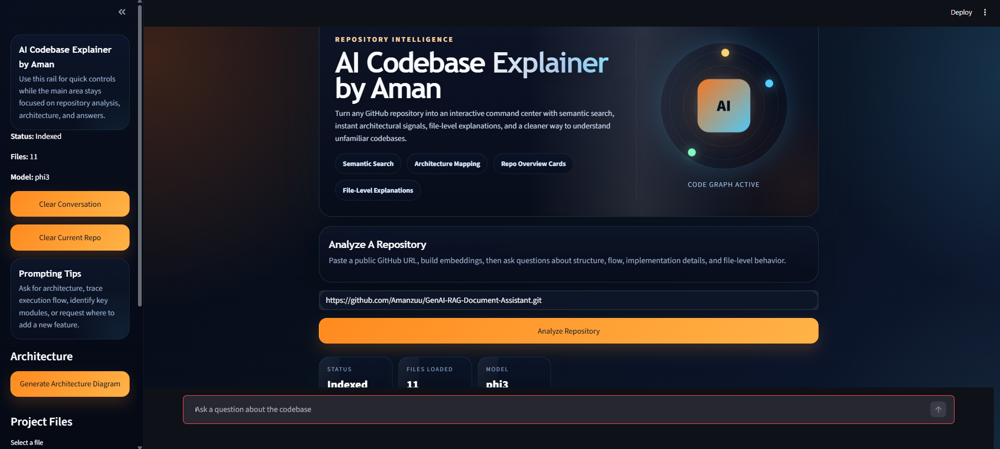
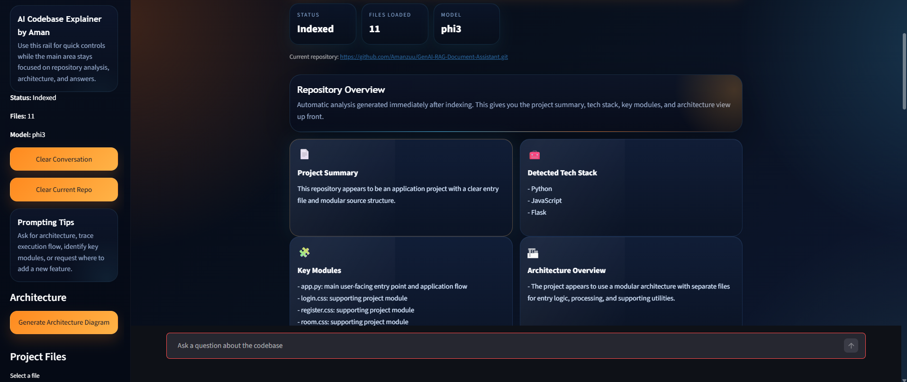

<div align='center'>
    <h1 align='center'> AI Codebase Explainer by Aman </h1>
    <p align='center'> A modern Streamlit-based repository intelligence app that clones a GitHub codebase, indexes it with FAISS + HuggingFace embeddings, and lets users explore architecture, run semantic code search, and ask natural-language questions answered by a local Ollama LLM. </p>
    <div>
        
        
        
        
        
        
    </div>
</div>

### Project Overview

*This project focuses on building an end-to-end local codebase assistant with semantic retrieval, repository analysis, architecture visualization, and an interactive chat interface for understanding unfamiliar GitHub repositories faster.*

- **GitHub Repository Indexing:** Clone a public repository directly from the UI and load supported source files.
- **Semantic Code Search:** Search the indexed codebase using FAISS similarity search and inspect top matching snippets.
- **RAG Pipeline:** Split code into chunks, generate embeddings, store them in FAISS, and retrieve relevant context for answers.
- **Local AI Inference:** Uses Ollama (`phi3`) so repository explanations and Q&A run locally.
- **Repository Intelligence UI:** Get project summaries, tech stack detection, key module analysis, and architecture insights.
- **Architecture Diagram Generation:** Visualize likely repository structure and flow using Graphviz.
- **Persistent Vector Index:** Cached FAISS indexes are auto-loaded across app restarts for the same repository.
- **PDF Report Export:** Download the generated repository analysis as a PDF report.

<div align='center'>
    
    <p align="center"><em>Repository analysis, semantic search, and interactive code exploration</em></p>
</div>

<div align='center'>
    
    <p align="center"><em>Polished Streamlit interface with repository insights and AI-assisted workflow</em></p>
</div>

### Tools and Technologies

| Tool / Library | Purpose |
|------|-------------|
| Streamlit | Interactive web application UI |
| LangChain | Retrieval and question-answering orchestration |
| FAISS | Vector similarity search over code chunks |
| HuggingFace Embeddings | Embedding generation (`all-MiniLM-L6-v2`) |
| Ollama | Local LLM inference (`phi3`) |
| GitPython | Clone GitHub repositories locally |
| Graphviz | Architecture diagram rendering |
| Python | Application logic and pipeline orchestration |

### Pipeline Workflow

**(1) Repository Input**

- User enters a public GitHub repository URL from the app UI.
- The repository is cloned locally under `repos/`.

**(2) File Loading**

- Supported source files are discovered and read from the cloned repository.
- A file map is created so the UI can browse and explain specific files.

**(3) Chunking & Indexing**

- Source code is split into chunks using LangChain text splitters.
- Embeddings are generated with HuggingFace.
- Chunks are indexed in FAISS and cached locally.

**(4) Retrieval**

- On each question or semantic search query, the most relevant code chunks are retrieved from FAISS.

**(5) Generation**

- Retrieved context is passed to Ollama (`phi3`) through the RAG pipeline.
- The model generates repository-aware answers for architecture, module behavior, and codebase questions.

**(6) UI Rendering**

- Users can inspect semantic search results, open file-level explanations, generate architecture diagrams, and export analysis as PDF.

### Features

| Feature | Description |
|------|-------------|
| Repository Q&A | Ask natural-language questions about the indexed codebase |
| Semantic Search | Find the most relevant code snippets by meaning, not just keywords |
| File Explanation | Select a file and get a plain-language explanation |
| Repo Overview | See summary, key modules, tech stack, and architecture overview |
| Architecture Diagram | Generate a visual Graphviz-based architecture map |
| PDF Export | Download the current repository analysis as a PDF |

### Setup on Your Machine

#### Prerequisites

- Python 3.10+ recommended
- Ollama installed and running locally
- `phi3` model available in Ollama
- Graphviz installed on your machine if diagram rendering requires it in your environment

#### Clone Repository

```bash
git clone <your-repo-url>
cd ai-codebase-explainer
```

#### Create Virtual Environment (Recommended)

```bash
python -m venv .venv
```

Activate on Windows PowerShell:

```bash
.\.venv\Scripts\Activate.ps1
```

#### Install Dependencies

```bash
pip install -r requirements.txt
```

#### Pull Ollama Model

```bash
ollama run phi3
```

#### Start the App

```bash
streamlit run app.py
```

Open:

`http://localhost:8501`

### Project Structure

| Path | Description |
|------|-------------|
| `app.py` | Main Streamlit application and UI logic |
| `repo_loader.py` | Clones GitHub repositories locally |
| `code_loader.py` | Loads supported source files from the repository |
| `embeddings.py` | Chunking, embedding generation, and FAISS vector store creation |
| `rag_pipeline.py` | RetrievalQA chain creation with Ollama |
| `repo_analyzer.py` | Generates repository summary, module insights, and architecture overview |
| `semantic_search.py` | Semantic search helper for top-k matching code chunks |
| `architecture.py` | Graphviz architecture diagram generation |
| `requirements.txt` | Python dependencies |
| `.cache/vector_store/` | Cached FAISS indexes created at runtime |
| `repos/` | Cloned repositories created at runtime |

### Stopping the App

| Action | Command |
|------|-------------|
| Stop Streamlit server | Press `CTRL+C` in terminal |
